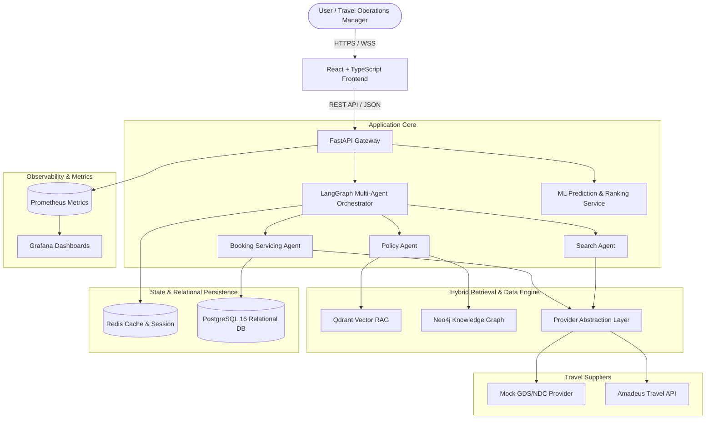

# TravelOps AI: Production Agentic AI + RAG + GraphRAG + ML Travel Operations Platform

[](https://www.python.org/downloads/)
[](https://fastapi.tiangolo.com)
[](https://docs.docker.com/compose/)
[](https://opensource.org/licenses/MIT)

> **TravelOps AI** is an enterprise-grade travel operations platform combining multi-agent orchestration, hybrid RAG & GraphRAG retrieval, tabular machine learning, and travel provider abstractions.

---

## 1. Problem Statement & Real-World Use Case

Modern travel operations demand high-accuracy search, strict policy adherence (cancellations, fare conditions, refunds), real-time disruption handling, and auditable actions. Conventional travel chatbots suffer from:
1. **Hallucination Risk**: Generating false fare rules or refund terms.
2. **Lack of Relational Awareness**: Missing complex airline alliances, codeshares, route graphs, and supplier policies.
3. **Unbounded Autonomy**: Accidentally executing destructive or monetary booking changes without explicit human confirmation.
4. **Unranked Options**: Presenting raw flight dumps rather than machine-learning-ranked, personalized choices.

**TravelOps AI** solves this with a **deterministic, agentic multi-agent architecture** bounded by strict human-in-the-loop controls, backed by Neo4j Knowledge Graphs, Qdrant Vector Search, and LightGBM ranking models.

---

## 2. High-Level System Architecture



---

## 3. Technology Stack

| Domain | Technology | Purpose |
|---|---|---|
| **API Gateway** | FastAPI, Uvicorn, Pydantic v2 | Async REST endpoints, validation, schema generation |
| **Agent Orchestration** | LangGraph, LangChain Core | Bounded agent workflows with explicit state machines |
| **Vector Database** | Qdrant | Dense vector retrieval for fare rules & NDC documentation |
| **Knowledge Graph** | Neo4j 5 (Cypher) | Airline route network, alliance relationships, policy graphs |
| **Relational Store** | PostgreSQL 16 (SQLAlchemy 2.0 Async) | ACID bookings, traveler profiles, tickets, auditable events |
| **Caching & State** | Redis 7 | Transient search caches, rate limiting, agent memory |
| **Machine Learning** | LightGBM, XGBoost, Scikit-learn, SHAP | Flight ranking and fare anomaly detection |
| **Frontend UI** | React 18, TypeScript, Vite, TailwindCSS | Operational travel console, agent tracing, audit modal |
| **Monitoring** | Prometheus, Grafana | Latency histograms, agent token usage, tool metrics |
| **Containerization** | Docker, Docker Compose | Reproducible multi-service deployment |

---

## 4. Phase-by-Phase Roadmap

- [x] **Phase 0 — Project Foundation** (Repository, Docker Compose, CI tooling, Health/Ready/Version probes)
- [x] **Phase 1 — Travel Data Model** (PostgreSQL schema, SQLAlchemy 2.0 models, Alembic migrations, Repositories)
- [x] **Phase 2 — Provider Abstraction** (Flight/Hotel/Booking provider interfaces, Mocks, Amadeus adapter, Error normalization)
- [x] **Phase 3 — Travel Data Ingestion** (Idempotent multi-format pipeline for PDF, HTML, JSON, CSV, API; SHA-256 provenance)
- [x] **Phase 4 — Production RAG** (Structure-aware chunking, embeddings, Qdrant hybrid retrieval, reranking, citations, POST /rag/query)
- [x] **Phase 5 — Neo4j Knowledge Graph** (12 entity types, schema constraints, multi-hop Cypher traversals, in-memory graph fallback, API endpoints, CLI sync runner)
- [x] **Phase 6 — GraphRAG** (Entity extraction, Knowledge Graph subgraph traversal, Qdrant vector fusion, grounded generation, POST /graphrag/query)
- [x] **Phase 7 — Travel ML** (Gradient Boosted flight ranker, feature attribution explainability, route fare anomaly detection, POST /ml/rank-flights, POST /ml/fare-anomaly)
- [x] **Phase 8 — Agentic AI** (LangGraph multi-agent state machine across Search, Policy QA, Disruption Rebooking, and Hotel discovery)
- [x] **Phase 9 — Human-in-the-Loop** (Strict confirmation checkpoints for booking/cancellation/rebooking)
- [ ] **Phase 10 — Agent Memory** (PostgreSQL persistent memory + Redis short-term session cache)
- [ ] **Phase 11 — Evaluation System** (RAG precision@k, agent tool accuracy, ranking NDCG benchmarks)
- [ ] **Phase 12 — Observability** (Prometheus custom metrics & Grafana dashboard provisioning)
- [ ] **Phase 13 — Caching Layer** (Redis caching with TTL and invalidation policies)
- [ ] **Phase 14 — Frontend Console** (React assistant, agent execution traces, provenance links)
- [ ] **Phase 15 — Production API** (Validated REST v1 endpoints with OpenAPI 3.1)
- [ ] **Phase 16 — Security** (Prompt injection defenses, tool sandboxing, audit trails)
- [ ] **Phase 17 — Automated Testing** (Unit, integration, and E2E agent scenario test suite)
- [ ] **Phase 18 — CI/CD Pipeline** (GitHub Actions automated test, lint, and build verification)
- [ ] **Phase 19 — Production Documentation** (Complete architecture specifications and runbooks)
- [ ] **Phase 20 — Final Integration & Verification** (Comprehensive end-to-end journey tests)

---

## 5. Getting Started (Phase 0)

### Prerequisites
- Python 3.11+
- Node.js 20+ & npm
- Docker & Docker Compose

### Quick Setup

1. **Clone & Setup Environment:**
   ```bash
   cp .env.example .env
   ```

2. **Run Services with Docker Compose:**
   ```bash
   docker compose up -d --build
   ```

3. **Verify Health Probes:**
   - Liveness: `curl http://localhost:8000/health`
   - Readiness: `curl http://localhost:8000/ready`
   - Version: `curl http://localhost:8000/version`
   - Metrics: `curl http://localhost:8000/metrics`
   - API Docs: `http://localhost:8000/docs`
   - Frontend UI: `http://localhost:3000`
   - Grafana: `http://localhost:3001` (admin / admin)
   - Prometheus: `http://localhost:9090`
   - Neo4j Browser: `http://localhost:7474` (neo4j / travelops_neo4j_password)
   - Qdrant Dashboard: `http://localhost:6333/dashboard`

4. **Run Backend Tests Locally:**
   ```bash
   pytest backend/tests -v
   ```

5. **Knowledge Graph Synchronization & Traversal:**
   - Run batch graph synchronization CLI:
     ```bash
     python scripts/ingest_graph.py
     ```
   - Query flight context via API:
     ```bash
     curl http://localhost:8000/api/v1/graph/flight/EK505
     ```
   - Query airline cancellation policies:
     ```bash
     curl "http://localhost:8000/api/v1/graph/airline/AI/policies?policy_type=CANCELLATION"
     ```
   - Query destination hotels:
     ```bash
     curl http://localhost:8000/api/v1/graph/destination/DXB/hotels
     ```
   - Trigger graph sync via REST:
     ```bash
     curl -X POST http://localhost:8000/api/v1/graph/sync
     ```

6. **GraphRAG Intelligence Query & Diagnostic Explain:**
   - Execute grounded GraphRAG query:
     ```bash
     curl -X POST http://localhost:8000/api/v1/graphrag/query \
       -H "Content-Type: application/json" \
       -d '{"query": "What is the cancellation policy and fee for Air India flight AI915?", "flight_number": "AI915"}'
     ```
   - Inspect GraphRAG diagnostic breakdown (entities, graph facts, and retrieved vector chunks):
     ```bash
     curl -X POST http://localhost:8000/api/v1/graphrag/explain \
       -H "Content-Type: application/json" \
       -d '{"query": "What are Emirates cancellation rules?", "airline": "EK"}'
     ```

7. **Travel Machine Learning (Ranking & Fare Intelligence):**
   - Train and serialize ranking model:
     ```bash
     python scripts/train_ranking_model.py
     ```
   - Evaluate route fare price anomaly (Deal / Normal / Surge):
     ```bash
     curl -X POST http://localhost:8000/api/v1/ml/fare-anomaly \
       -H "Content-Type: application/json" \
       -d '{"origin": "BOM", "destination": "DXB", "fare_amount": 15500.0, "currency": "INR", "cabin_class": "ECONOMY"}'
     ```
   - Rank flight offers with utility scoring & explainability:
     ```bash
     curl -X POST http://localhost:8000/api/v1/ml/rank-flights \
       -H "Content-Type: application/json" \
       -d '{"offers": [...], "preferences": {"prefer_nonstop": true, "preferred_airline": "EK"}}'
     ```

8. **Agentic AI Conversational State Machine:**
   - Multi-agent conversational search query:
     ```bash
     curl -X POST http://localhost:8000/api/v1/agents/chat \
       -H "Content-Type: application/json" \
       -d '{"query": "Find flights from Mumbai to Dubai next week"}'
     ```
   - Policy grounding & Q&A via LangGraph:
     ```bash
     curl -X POST http://localhost:8000/api/v1/agents/chat \
       -H "Content-Type: application/json" \
       -d '{"query": "What is the cancellation penalty for Air India?"}'
     ```
   - Inspect active agent thread state and trace:
     ```bash
     curl http://localhost:8000/api/v1/agents/state/{thread_id}
     ```

9. **Human-in-the-Loop (HITL) Safety Checkpoints:**
   - List queued pending action proposals awaiting confirmation:
     ```bash
     curl http://localhost:8000/api/v1/agents/hitl/pending
     ```
   - Inspect specific action proposal details and risk assessment:
     ```bash
     curl http://localhost:8000/api/v1/agents/hitl/actions/{action_id}
     ```
   - Confirm and execute pending action proposal (e.g. flight rebooking):
     ```bash
     curl -X POST http://localhost:8000/api/v1/agents/hitl/actions/{action_id}/confirm \
       -H "Content-Type: application/json" \
       -d '{"operator_id": "ops_agent_01", "notes": "Approved by traveler"}'
     ```
   - Reject pending action proposal:
     ```bash
     curl -X POST http://localhost:8000/api/v1/agents/hitl/actions/{action_id}/reject \
       -H "Content-Type: application/json" \
       -d '{"operator_id": "traveler_app", "reason": "Passenger prefers alternate schedule"}'
     ```
   - Inspect operational audit trail:
     ```bash
     curl http://localhost:8000/api/v1/agents/hitl/audit/trail
     ```

