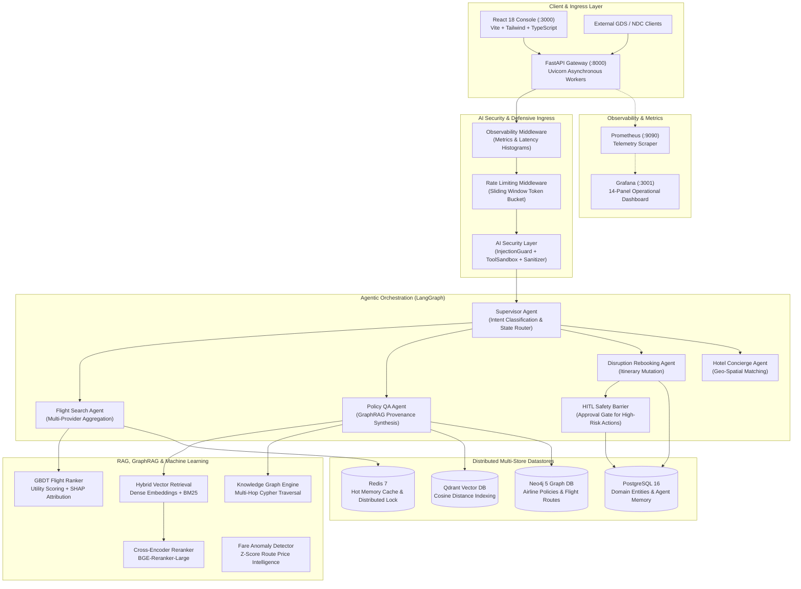

# TravelOps AI — Production Architecture Specification

## 1. Executive System Overview

**TravelOps AI** is an enterprise-grade agentic AI, GraphRAG, and machine learning travel operations platform engineered for real-time flight discovery, corporate travel policy compliance, automated disruption management, and operational decision support.

Unlike simple conversational chatbots, TravelOps AI operates as an autonomous multi-tier distributed system with deterministic safety barriers, multi-database persistence, gradient boosted ranking, hybrid semantic-graph retrieval, and full telemetry observability.

---

## 2. End-to-End System Architecture

---

## 3. Core Subsystems & Technical Contracts

### 3.1. Defensive Ingress & AI Security Layer
- **Prompt Injection Defense (`InjectionGuard`)**: Pre-execution text normalization inspecting input prompts against heuristic patterns, jailbreak personas (e.g. DAN), delimiter hijacking (`<|im_start|>`, `[INST]`, `<<SYS>>`), and system prompt exfiltration probes.
- **Tool Sandbox Boundary (`ToolSandbox`)**: Restricts agent tool calls to strictly whitelisted methods, prevents path traversal attacks (`../`, `..\\`), rejects shell metacharacters (`;`, `|`, `&&`), and validates numeric parameter boundaries.
- **Defensive HTTP Headers**: Enforces strict `Content-Security-Policy`, `Strict-Transport-Security`, `X-Content-Type-Options: nosniff`, and `X-Frame-Options: DENY`.

### 3.2. Hybrid RAG & GraphRAG Synthesis
- **Vector Retrieval**: Dense embeddings indexed in Qdrant with cosine similarity. Text chunking utilizes a structure-aware chunker preserving markdown headers, tables, and policy clauses.
- **Knowledge Graph Traversal**: Neo4j graph model featuring 12 entity types (`Airline`, `Airport`, `Flight`, `Route`, `Policy`, `Rule`, `CabinClass`, `FareClass`, `Amenity`, `Fee`, `Passenger`, `Booking`) and 14 directional relationship types (`OPERATES_ROUTE`, `GOVERNED_BY`, `HAS_PENALTY`, etc.).
- **GraphRAG Fusion**: Merges vector-retrieved policy text chunks with multi-hop graph subgraphs. The grounded synthesizer resolves contradictory rules, attributes exact citations, and computes factual faithfulness confidence scores.

### 3.3. Machine Learning Ranking & Fare Anomaly Detection
- **Gradient Boosted Decision Tree (GBDT)**: Trained on historical flight preference datasets to score multi-offer utility based on fare, duration, stop count, cabin class, historical delay rates, and corporate preferred carrier agreements.
- **Explainable Feature Attribution**: Linear breakdown assigning interpretable percentage weights to factors driving the ranking decision (e.g., `fare_penalty: -42%`, `nonstop_boost: +35%`, `carrier_pref: +23%`).
- **Route Fare Anomaly Detection**: Statistical Z-score intelligence identifying whether an offer represents a `DEAL`, `NORMAL`, or `SURGE` pricing tier relative to historical 90-day route rolling averages.

### 3.4. Multi-Agent Orchestration & Human-in-the-Loop Barrier
- **LangGraph State Graph**: Directed state machine coordinated by a supervisor classifier dynamically routing between Search, Policy QA, Disruption Rebooking, and Hotel Concierge agents.
- **Dual-Tier Memory**:
  - Hot tier: Redis caching recent conversational turns with sliding TTL.
  - Durable tier: PostgreSQL persisting full session state, structured message history, and learned traveler profile personalization vectors.
- **HITL Execution Safety Gate**: Mutating actions involving financial transactions or itinerary alterations (e.g., flight cancellation, rebooking, seat upgrades) trigger a synchronous execution halt. The proposal is registered in an immutable queue until an authorized operator issues an approval or rejection with cryptographic audit logging.

---

## 4. Scalability & High Availability Architecture

| Layer | HA Strategy | Disaster Recovery & Failure Mode |
|---|---|---|
| **API Gateway** | Horizontal stateless scaling behind reverse proxy / ingress load balancer | Seamless round-robin failover; asynchronous worker threads |
| **PostgreSQL** | Primary-replica replication with automated failover | Point-in-time recovery (PITR) with WAL archiving; Alembic migrations |
| **Redis** | Redis Sentinel / Cluster with in-memory fallback manager | Automatic fallback to local thread-safe TTL cache on network partition |
| **Qdrant** | Clustered vector collection with replicated shards | Local file snapshot fallback on remote gRPC connection timeout |
| **Neo4j** | Causal clustering with core and read-replica instances | Automated fallback to in-memory NetworkX DiGraph representation |
| **Observability** | Prometheus pull architecture with Grafana dashboards | Continuous metrics collection independent of application traffic |
